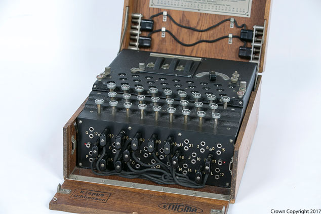

## Introduction

Make and then break Enigma-encoded messages using your Raspberry Pi or [OctaPi](http://projects.raspberrypi.org/en/projects/build-an-octapi){:target="_blank"}.

### What you will make

You will install [Py-enigma](http://py-enigma.readthedocs.org/){:target="_blank"} and use it to create encrypted messages (secret messages only you and those you trust can read). You will then develop Python code to do a partial brute force crypt attack on the Enigma messages and recover the machine's rotor settings.  

### What you will learn

This project covers elements from the following strands of the [Raspberry Pi Digital Making Curriculum](http://rpf.io/curriculum){:target="_blank"}:

+ [Apply higher-order programming techniques to solve real-world problems](https://curriculum.raspberrypi.org/programming/maker/){:target="_blank"}

### Licence

OctaPi: Brute force Enigma by [GCHQ](https://www.gchq.gov.uk/){:target="_blank"} and the Raspberry Pi Foundation is licensed under a Creative Commons Attribution 4.0 International Licence.
Based on a work at [github.com/raspberrypilearning/octapi-calculating-pi](https://github.com/raspberrypilearning/octapi-calculating-pi){:target="_blank"}.

**Code and scripts**
Copyright: [Crown Copyright](https://www.nationalarchives.gov.uk/information-management/re-using-public-sector-information/uk-government-licensing-framework/crown-copyright/){:target="_blank"}
License: [Apache 2](https://www.apache.org/licenses/LICENSE-2.0){:target="_blank"}
