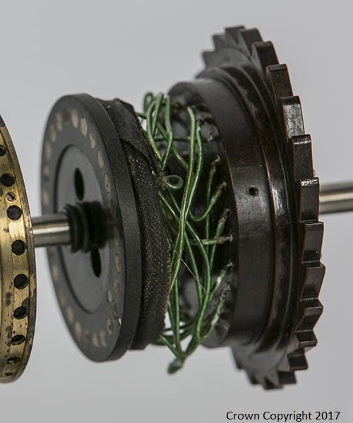

## What is Enigma, and how does it work?

Enigma is a cipher machine that was created in the early 20th century for commercial, diplomatic, and military applications. The machine was adopted by the German military during World War II for secret communications. The Enigma encryption code was famously broken at Bletchley Park, the forerunner of GCHQ, during WWII, meaning intercepted radio messages from the German military could be decoded and read. This spectacular achievement is thought to have shortened the war, saving many lives on both sides of the conflict.

From an electrical point of view, the Enigma machine is simply a battery, a bulb, and a switch circuit. It doesn't have any electronics, so it is an electro-mechanical device. Encryption is achieved by varying the path of an electric current through the wiring of the machine.

In the diagram above, we show how a character on the keyboard goes through many stages of transposition before being routed to a lightbulb on the lamp board representing the encrypted letter. The user types their plain text message on the keyboard character by character, and reads the cipher text as each bulb is illuminated on the lamp board in response.

Let's look at the rotors and the reflector first.

### Rotors and reflector

Inside the machine, a number of rotors with 26 contacts (one for each letter from A to Z) are stacked together to create the current path through the heart of the machine. Each rotor wheel has electrical contacts on both sides and a jumble of wiring between them, so that the letters are transposed from one side to the other.

In the photo above, you can see the jumble of wiring inside an expanded rotor wheel from a WWII-captured Enigma machine. By stacking several rotors and using a reflector at the end to return the current back through the rotors, each letter is transposed many times. The reflector's transposition setting is fixed, ensuring that the current returns back through the machine without reversing the transposition.

### Selecting rotors

When using the Enigma machine, three rotors are selected from five available ones (there were also machines with four rotors). The bottom-most rotor advances as each letter of the message is typed, so that a different transposition is used character by character. For instance, when the user types in 'LL', both letters will not be encrypted the same, so the result might be 'XV'. After the first rotor has advanced 26 positions, the machine advances the next rotor by one, and so on.

However, part of what makes the Enigma encryption difficult to break is the fact that each rotor can be used at a different starting position. For example, if a rotor is set to position 10 and the letter A is typed into the machine, it will enter not where A enters by default, but where J (letter 10 in the alphabet) enters. Moreover, set to this position the rotor can only move 16 steps before the next rotor starts advancing. So that it can be set more easily, the rotor is marked by an alphabet ring. Hence a start position of 10 would be achieved by setting the rotor so that the letter J is visible; a 3-rotor start position of "JFM" would mean setting the first rotor to J, the second to F, and the third to M.

### Slip rings

It is also possible to slip round the letter assignments using a slip ring on the rotor. Rotating the ring rotates the wiring **inside** the rotor. For example, let's say that with the slip ring in default position, the rotor's wiring would transpose A into E, B into K, C into M, and so on. Moving the slip ring by 1 would mean that the letter A would be transposed into K, B into M, etc.

### Plugboard

As if this wasn't enough, the German version of the Enigma machine also featured a plugboard (the leftmost green box in the diagram at the top), which can be manually adjusted so that up to ten pairs of letters are transposed as they go into the rotors and again when they come back out.

### Encryption settings

Combining three rotors from a set of five, the rotor settings with 26 positions, and the plugboard with ten pairs of letters connected, the Enigma machine used by WWII military had 158962555217826360000 (nearly 159 quintillion) different settings.

The encryption relied on both the sending and receiving Enigma machines being set the same. To do this, a settings sheet was used at both communicating stations. The sheet specified:
- Which rotors (of those available) should be selected, and in what order they should be inserted into the machine
- How much each rotor should be slipped round
- Which letters should be changed by the plugboard
- Which rotor start positions should be used

### Rotor start position and one-off key

A different set of machine settings was used each day, and the rotor start position was changed every six hours, so the machine setting was very time-sensitive.

This is an Enigma settings sheet captured at the end of WWII which has been released by GCHQ for this project. In the expanded view of one of the lines shown below, you can see how the various settings are laid out:

The settings we've highlighted are for the first day of the month, hence the "1" in the second column. The next column shows that rotors IV, I, and V should be selected and used in that order. The fourth column holds the slip ring settings: rotor IV should be slipped round to position 20 (A = T), rotor I to position 5 (A = E), and rotor V to position 10 (A = J). Next comes the plugboard wiring: S to X, K to U, Q to F, and so on. Finally, the start position for the rotors should be "SRC", "EEJ, "FNZ", or "SZK" for each 6-hour period of the day.

On top of that, there were two reflectors, B or C, one of which was chosen for use. For the encryption and decryption programs here, we will assume use of reflector B.

For each message, the sender also selected three characters for themselves as a one-off message key — let's say "RPF". They encrypted this key using the settings from the settings sheet and noted down the result — let's say "QMD". They would then proceed to encrypt their message using their one-off key, here "RPF", as the start positions of the rotors, noting down the encrypted text the machine returns. The encrypted version of the key, here "QMD", plus the encrypted text is what was then sent to the recipient via radio.
