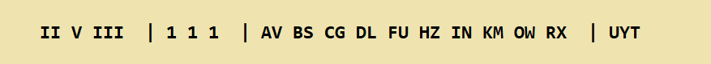

## Decrypt a message

Imagine you are an Enigma operator and you've just received this message:


Let's write some code using Py-enigma to simulate using an Enigma machine to decrypt the message.

+ Open IDLE and create a new file. Save it as `decrypt.py`

[[[rpi-gui-idle-opening]]]

+ First, import the `EnigmaMachine` class from `Py-enigma`. Add this code to your file:

```python
from enigma.machine import EnigmaMachine
```

You consult your Enigma settings sheet and find out that the machine that encrypted the message had the following settings at the time the message was sent:



+ In your Python file, set up an Enigma machine object. Use the same settings as on your settings sheet. Each setting should be a string and should be typed exactly as it appears on the settings sheet, for example the rotors would be set as `'II V III'`.

```python
# Set up the Enigma machine
machine = EnigmaMachine.from_key_sheet(
   rotors='',
   reflector='B',
   ring_settings='',
   plugboard_settings='')
```

+ Add some code to set the initial position of the Enigma machine rotors to U, Y and T, to match the sending machine.

```python
# Set the initial position of the Enigma rotors
machine.set_display('UYT')
```

You were sent "PWE" by the other operator as the encrypted key for this message. It was encrypted before sending to prevent an eavesdropper from being able to read it.

You first need to use your Enigma machine to recover the _actual_ message key by decrypting "PWE" using the settings sheet's rotor start position: U, Y and T.

+ Add the following code and run your program to display the decrypted key

```python
# Decrpyt the text 'PWE' and store it as msg_key
msg_key = machine.process_text('PWE')
print(msg_key)
```

+ Add some code at the bottom of the program to set the Enigma machine's rotor starting positions to the decrypted message key you just obtained.

--- hints ---
--- hint ---
Look at how you originally set the rotor positions to UYT and see if you can use this code to set the rotor positions to the new setting.
--- /hint ---
--- hint ---
Here is how your code should look:

```python
# Set the new start position of the Enigma rotors
machine.set_display(msg_key)
```
--- /hint ---
--- /hints ---

You are now ready to decrypt the message.

+ Write some code to decrypt the cipher text.

--- hints ---
--- hint ---
This code will be very similar to the code you used to decrypt the key. Create a **variable** to store the result, use the `machine` to process the cipher text and then **print** the result.
--- /hint ---
--- hint ---
Here is how your code should look:

```python
ciphertext = 'YJPYITREDSYUPIU'
plaintext = machine.process_text(ciphertext)

print(plaintext)
```
--- /hint ---
--- /hints ---

--- collapse ---
---
title: What is the decrypted message?
---
If all is well, you should see the script exit without any errors, and the decrypted message "THISXISXWORKING".

--- /collapse ---
