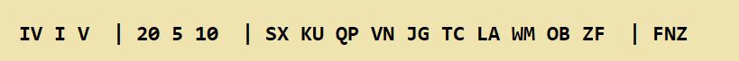

## Encrypt a message

Suppose you need to send a message back using your Enigma machine. You look up today's settings in your settings sheet:



+ Create a new Python file and save it as `encrypt.py`

+ Inside your file, import the EnigmaMachine class and set up the machine with the settings shown on the settings sheet. Like last time, use reflector B.

+ Write another line of code to set the rotor start positions to the setting from the sheet.

+ Choose three random letters to use as your message key - as an example we will choose "BFR". Encrypt the message key using the rotor settings from the sheet, then make a note of the result which is the encrypted key you will send with your message.

+ Set the rotor start positions to your **unencrypted** message key (in our example, "BFR").

+ Write some code to process the `plaintext` "RASPBERRYPI" and display the resulting `ciphertext`.

--- hints ---
--- hint ---
Look at the code you wrote to decrypt the message and see what you can reuse.
--- /hint ---
--- hint ---
Here is the blank set up code for the Enigma machine object:

```python
# Set up the Enigma machine
machine = EnigmaMachine.from_key_sheet(
   rotors='',
   reflector='B',
   ring_settings='',
   plugboard_settings='')
```
--- /hint ---
--- hint ---
You can set the starting position of the rotors with the `set_display` method. Replace the `???` with your settings.

```python
machine.set_display('???')
```
--- /hint ---
--- /hints ---


**What do you notice about the processes of encrypting and decrypting text?**

--- collapse ---
---
title: Answer
---
They are exactly the same! The code you wrote in this section is identical to the code you wrote to decrypt the message.

The resulting ciphertext should be "GON XXLXYFQNZIK" if you used the message key BFR. You may have chosen a different message key, in which case your result will be different.
--- /collapse ---

You can also run pyenigma from the command line if you wish. Typing this command into the terminal produces the same result as the program above.

```bash
pyenigma.py -r IV I V -i 20 5 10 -p SX KU QP VN JG TC LA WM OB ZF -u B --start BFR --text "RASPBERRYPI"
```

**Do any of the characters ever get encrypted as themselves (ie does "A" get encrypted as "A", "B" as "B", etc...)**

--- collapse ---
---
title: Answer
---
No. In fact this is a weakness of the Enigma system because an attacker can eliminate all possible crypt attack solutions where an "A" is decrypted as an "A", and so on.

--- /collapse ---


### Challenge

Try encrypting text using different settings from a real Enigma settings sheet to see how the text changes.


