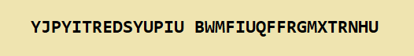

## Standalone crypt attack

During World War II cryptographers at Bletchley Park were working hard to try to break the Enigma cipher by hand. In this next section, we will develop a brute force crypt attack on the Enigma cipher text using a Raspberry Pi.

A brute force attack is simply an exhaustive search over all possible machine settings to try and find which one was used. For the time being, we will ignore the plug board setting (and assume that is known).

Here is the message that was intercepted



We will use a crib text with our cipher text, which is a guess at what the cipher text might be. This may seem like a cheat, but is actually exploiting a weakness of the Enigma system as used during WWII. Some of the text in messages was predictable, especially at the start. For example weather report messages were a good source of cribs as they often contained the word "WETTER" which is the German word for "weather".

We will use this crib to help us launch the brute force attack:

```python
ciphertext = "YJPYITREDSYUPIU"
cribtext = "THISXISXWORKING"
```

We will know if the attack has found the correct rotor choices and starting positions if the cipher text decrypts to the crib text.

+ Create a new Python file and save it as `bruteforce_standalone.py`

+ Add the strings containing the cipher text and the crib text to your file

We need to represent the selection of three out of five rotor wheels in our Python code. We could write code to generate the possibilities, but as there aren't very many, we can manually define them.

+ Copy this list of all possible rotor choices into your file

```python
rotors = [ "I II III", "I II IV", "I II V", "I III II",
"I III IV", "I III V", "I IV II", "I IV III",
"I IV V", "I V II", "I V III", "I V IV",
"II I III", "II I IV", "II I V", "II III I",
"II III IV", "II III V", "II IV I", "II IV III",
"II IV V", "II V I", "II V III", "II V IV",
"III I II", "III I IV", "III I V", "III II I",
"III II IV", "III II V", "III IV I", "III IV II",
"III IV V", "IV I II", "IV I III", "IV I V",
"IV II I", "IV II III", "IV I V", "IV II I",
"IV II III", "IV II V", "IV III I", "IV III II",
"IV III V", "IV V I", "IV V II", "IV V III",
"V I II", "V I III", "V I IV", "V II I",
"V II III", "V II IV", "V III I", "V III II",
"V III IV", "V IV I", "V IV II", "V IV III" ]
```

Our strategy will be to select each set of rotor choices in turn from the above list and check to see whether decrypting the cipher text with this combination of rotors obtains the crib text.

However, it is not as simple as just testing every single possible choice of rotors. Inside our function we will also need to search over all possible rotor start positions for the specified rotor combination as well.

For the time being we will assume the ring settings "1 1 1" and the plugboard settings "AV BS CG DL FU HZ IN KM OW RX" and we will discuss adding these later. The code breakers of Bletchley Park would not have had this luxury!

+ Create a function called `find_rotor_start()` which takes three arguments - the rotor choice, the cipher text and the crib text.

[[[generic-python-simple-functions]]]

+ Inside your function, add the code to import the `EnigmaMachine` class

```python
from enigma.machine import EnigmaMachine
```

We have imported the Py-Enigma module inside our function for a reason: this allows us to reuse this code later on with an OctaPi cluster so that we can run the search massively in parallel in much shorter time than we can on a single processor. For the time being, we will run our code on a single Raspberry Pi.

+ Write some code inside the function to test all possible rotor start positions for the given rotor choice. Remember that we are passing a rotor choice into the function, so you only need to test all start positions for the **specified** rotor choice, not for every possible rotor choice!

--- hints ---
--- hint ---
Import the EnigmaMachine class.

Create a string to store the alphabet so that you can easily loop through the letters.

Set up your Enigma machine object just as we did before. Use reflector B and the ring and plugboard settings we assumed earlier.

Loop through the alphabet to generate all possible start positions for each rotor. For example, if all rotors begin on A, the first start position to test might be AAA. The second might be AAB, then AAC etc until rotor 3 reaches the end of the alphabet. Increment rotor 2 and reset rotor 3 to A, resulting in ABA, ABB, ABC etc.

For each rotor start position, decrypt the given ciphertext and check whether it is the same as the crib text, printing the resulting plaintext as you go along. If it is, return the rotor choice and the start position.
--- /hint ---
--- hint ---
Here is how your code might look:

```python
def find_rotor_start( rotor_choice, ciphertext, cribtext ):
    from enigma.machine import EnigmaMachine
    alphabet = "ABCDEFGHIJKLMNOPQRSTUVWXYZ"

    machine = EnigmaMachine.from_key_sheet(
       rotors=rotor_choice,
       reflector='B',
       ring_settings='1 1 1',		
       plugboard_settings='AV BS CG DL FU HZ IN KM OW RX')		

    # Do a search over all possible rotor starting positions
    for rotor1 in alphabet:          # Search for rotor 1 start position
        for rotor2 in alphabet:      # Search for rotor 2 start position
            for rotor3 in alphabet:  # Search for rotor 3 start position

                # Generate a possible rotor start position
                start_pos = rotor1 + rotor2 + rotor3

                # Set the starting position
                machine.set_display(start_pos)

                # Attempt to decrypt the plaintext
                plaintext = machine.process_text(ciphertext)
                print( plaintext )

                # Check if decrypted version is the same as the crib text
                if plaintext == cribtext:
                    print("Valid settings found!")
                    return rotor_choice, start_pos

    # If we didn't manage to successfully decrypt the message
    return rotor_choice, "Cannot find settings"
```
--- /hint ---
--- /hints ---

Most of the time our function will fail to match the cipher and crib text because the rotor choice will be wrong. On one occasion (we hope!) the cipher and crib texts will match because we have found the machine setting used.

+ In the main part of your program, write a loop to call the function once for every possible rotor choice combination in the `rotors` list. For each time the function is called, print out the results. If ever a start position is returned that is not "Cannot find settings", break out of the loop - the settings have been found!

--- hints ---
--- hint ---
Use a for loop to loop through the list and call the function once for each item in the list.
--- /hint ---
--- hint ---
Here is how your code might look:

```python
for rotor_setting in rotors:
    rotor_choice, start_pos = find_rotor_start( rotor_setting, ciphertext, cribtext )
    print(rotor_choice + " " + start_pos )
    if start_pos != "Cannot find settings":
        break
```
--- /hint ---
--- /hints ---

+ Save and run your program. It will take quite a long time to run, but you should be able to see the results for each rotor choice as it executes.

+ Once the rotor choice and start position have been found, use the decrypt program you wrote earlier to decrypt the hidden message, using the rotor choice and start positions found with the brute force attack.

--- collapse ---
---
title: Answer
---

The settings were as follows: rotors = II V III / starting position = SCC
The secret message reads `"THISXISXWORKINGXOCTAPIXISXAWESOME"`

--- /collapse ---

We did not code the rotor slip ring settings. This setting allows the letters on each of the rotors to be shifted round (A to B, A to C, A to D, etc...). To deal with the rotor ring setting, we would need to modify and run the `find_rotor_start()` function repeatedly for every rotor slip ring setting.

**How much longer will it take to run the program if we code for a search over all possible slip ring settings as well?**

--- collapse ---
---
title: Answer
---
If we have an Enigma machine with three rotors, each rotor can have 26 slip ring positions (A to A (no shift), A to B, ..., A to Z, etc...). That means we have to run the search for the start position 26 times for the first rotor, and all of that 26 times for the second rotor, and all of that 26 times for the third rotor. So our brute force crypt attack program will take 26 x 26 x 26 = 17,576 times longer.

This is a very long time, but we could break up the problem into many parts and run these in parallel using OctaPi. This is what we will do next.

--- /collapse ---
