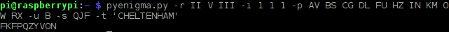
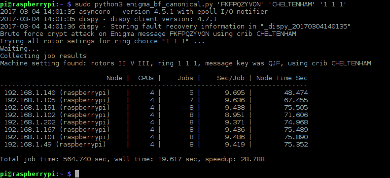
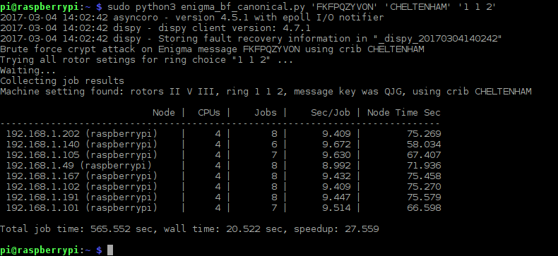

## Crypt attack on Enigma messages using OctaPi

### Installing Py-enigma on OctaPi
Before you begin, you will need to install  [Py-enigma by Brian Neal](http://py-enigmareadthedocs.org/) on both your client machine and all the servers in your OctaPi cluster.

Start with the client machine

1. Boot up the client and connected to the Internet. This will mean disconnecting from your OctaPi router and connecting to your Wi-Fi for Internet access.

1. Once on-line, open a terminal window

    

1. To install Brian Neal's Py-enigma on the OctaPi client, run the following commands.

    sudo pip3 install py-enigma
    sudo pip3 --upgrade py-enigma

This sequence of commands installs a Python 3 module and also a pyenigma.py command line Python application ready to use.

1. Disconnect the OctaPi client from the Internet and re-connect to your OctaPi Wi-Fi network

1. We need to remove any previous Wi-Fi information to avoid confusion.

    In a terminal window, type the following command to edit the `wpa_suplicant.conf` file:

    ```bash
    sudo nano \etc\wpa_suplicant\wpa_suplicant.conf
    ```

    Remove any entries in `wpa_suplicant` that are for Wi-Fi networks other than OctaPi, then press `Ctrl` + `o` to save and `Ctrl` + `x` to exit.

    **Important:** If alternative Wi-Fi networks are not removed, your client may log onto the wrong network.

Next, do the same for each of the servers.

1. Select one server, then connect and keyboard screen and mouse to it so that you can administer it directly from a terminal winow

1. Repeat all the steps needed to install Py-enigma that you followed for the client.

1. Remember to remove any entries in `wpa_suplicant` that are for Wi-Fi networks other than OctaPi

1. Shutdown the server and either repeat the installation the same way for the rest of the servers in you cluster, or replicate the microSD card.

## Running Py-enigma on OctaPi

To do an exhaust search of all rotor slip ring settings, we will need to run a lot of jobs on OctaPi using [Dispy](http://dispy.sourceforge.net/index.html). The demand on the OctaPi client machine for memory will be quite large, so we will need to run the program one ring setting at a time (if we are using the simple 'canonical' form of the code).

The OctaPi code using Dispy is very similar to the code we created for a standalone processor.

We will run the program using command line arguments in order to set the cipher text, crib text and rotor slip ring settings at run time. If our Python code is called 'enigma_bf_canonical.py', the command line will look like:

    sudo python3 enigma_bf_canonical.py 'FKFPQZYVON' 'CHELTENHAM' '1 1 1'

 Where
     'FKFQQZYVON' is cipher text produced by an Enigma machine, or the pyenigma.py utility
     'CHELTENHAM' is text that was encrrypted, we are using it as a crib

Starting with the code we wrote for a standalone processor, we need to create a cluster object on our OctaPi network and fill it with 'find_rotor_start()' jobs. This code goes in the main loop in the 'enigma_bf_canonical.py' script.

        cluster = dispy.JobCluster(find_rotor_start, nodes='192.168.1.*')
        jobs = []
        id = 1    # job id

        # submit the jobs for this ring choice
        for rotor_choice in rotor:
            job = cluster.submit( rotor_choice, ring_choice, ciphertext, cribtext )
            job.id = id # associate an ID to the job
            jobs.append(job)
            id += 1   # next job

In this code snippet we create the cluster object, then create a job for each call of 'find_rotor_start()'. The parameters are passed in the 'cluster.submit()' function call. The 'rotor' array is the same as we had before.

Next we need to wait for the jobs to complete before collecting the results returned from the cluster.

        print( "Waiting..." )
        cluster.wait()
        print( "Collecting job results" )

The last step is to sift through the results to see if any of the find_rotor_start() jobs didn't return the string "null", in which case the returned string must havce been a valid rotor start position (three characters).

        # collect and check through the jobs for this ring setting
        found = False
        for job in jobs:
            rotor_setting, ring_setting, start_pos = job() # waits for job to finish and returns results
            if (start_pos != "null"):
                found = True
                print(( "Rotors %s, ring %s, message key was %s, using crib %s" % (rotor_setting, ring_setting, start_pos, cribtext) ))

Lastly, we can tidy up and exit.

        if (found == False): print( 'Attack unsuccessfull' )

        cluster.print_status()
        cluster.close()


### Advanced coding challenge
Use the stanadlone code and these code fragments to assemble a working Python 3 app for OctaPi that distributes the 'find_rotor_start()' function acrross your OctaPi servers. Run it on a selection of crib texts and Enigma cipher text you have created with Py-enigma.

Our code for doing this is [here](source/enigma_bf_canonical.py).

  

  

### Question
If you run the OctaPi code with different ring settings, did you sometimes get more than one result? Why is this?

### Answer
You should have sometimes found multiple valid machine settings for the same rotor selections but with different rotor slip settings and rotor start positions. For example you could have found start position "ABC" with "1 1 1" and "ABD" with "1 1 2". This isn't a bug: both machine settings are valid. In fact there are multiple valid machine settings because the rotor slip ring creates multiple equivalent crypt solutions. This isn't another example of a mistake in the Enigma encryption technique, but shows how the nature of the cyber threat has changed in the 75 years since WWII. Originally, the risk was percieved to be from people successfully decrypting letter by letter. Changing the rotor slip ring meant that the rotors advanced at unexpected positions creating a discontinuity every 26, 26x26 and 26x26x26 chacaters; meaning that an attacker would have to keep starting again. With our Raspberry Pi based crypt attack using a simple brute force exhaust search over full range of possible machine settings, we find that the rotor slip ring setting creates multiple valid solutions. So for us, this feature is a weakness because less searching is needed to reach a valid solution.

Here's an example (compare with the screenshot above).

  

We could have saved a lot of time coding the slip ring search had we thought of this beforehand.

### Question
What is the minimum length of crib text needed to obtain the correct machine setting?

### Answer
If you run your code multiple time with less and less crib and cipher text characters, you should find that as few as four characters of crib text is enough to obtain the correct machine setting (there could be a handful of incorrect solutions as well). With less than four characters, there is soo much ambiguity that you will have trouble finding the correct solution amongst all the incorrect solutions.

### Very advanced coding challenge
If you have got this far, you could try coding the search over plug board settings. Before you start, try estimating if this is going to be achievable - even with an OctaPi cluster?
